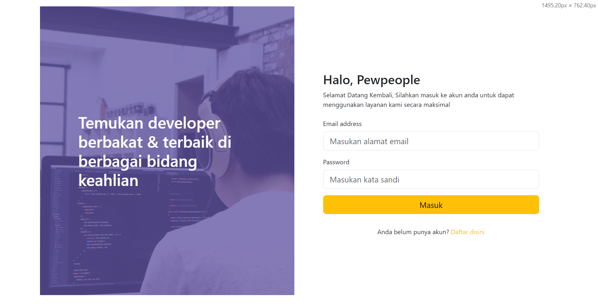
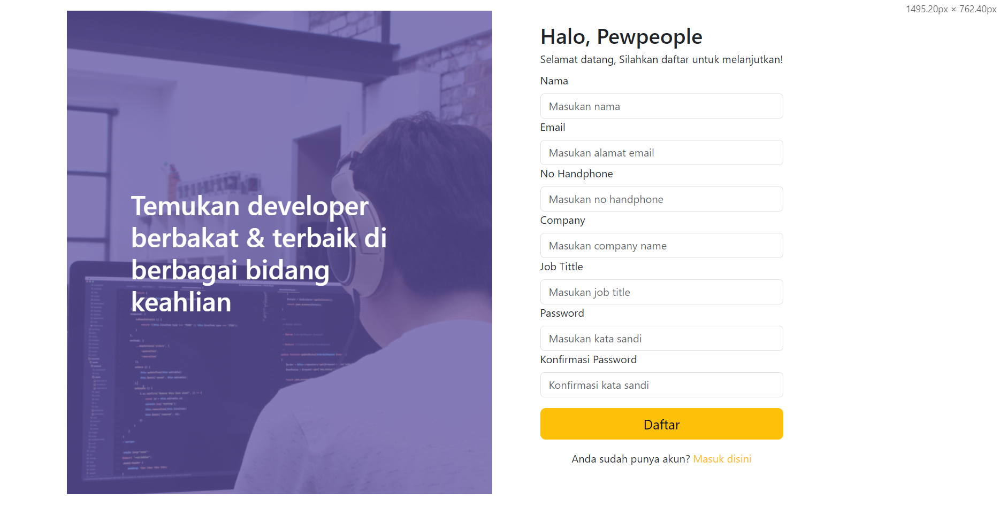
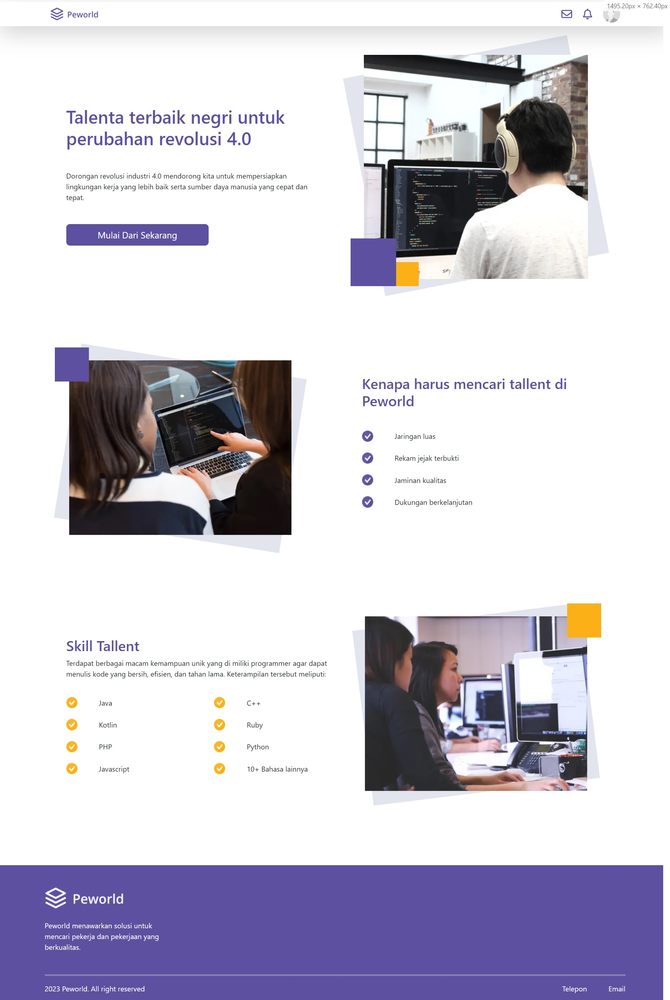
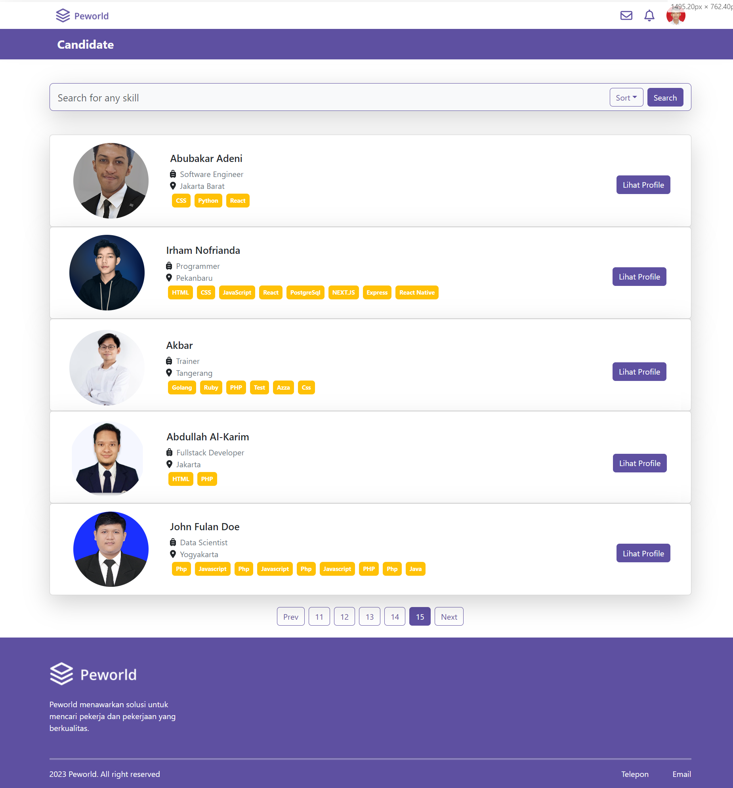
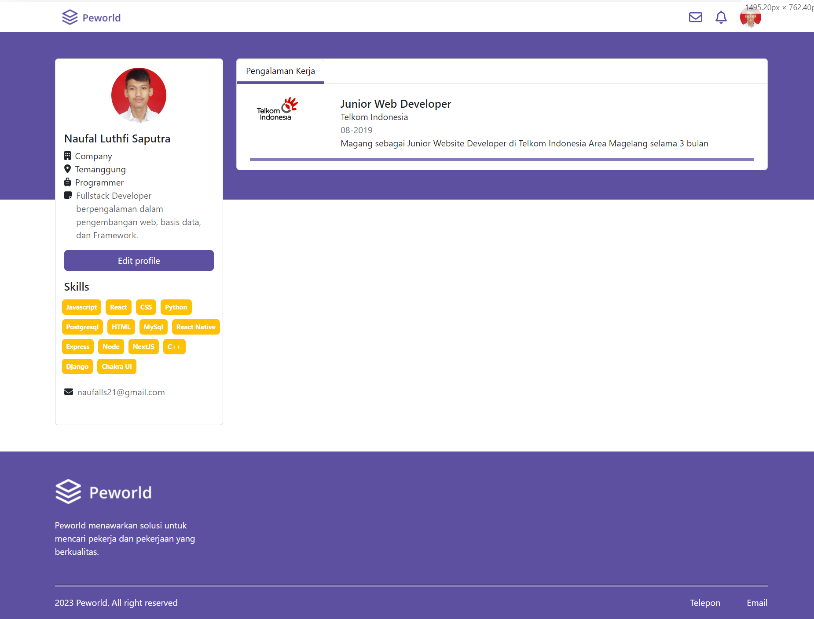
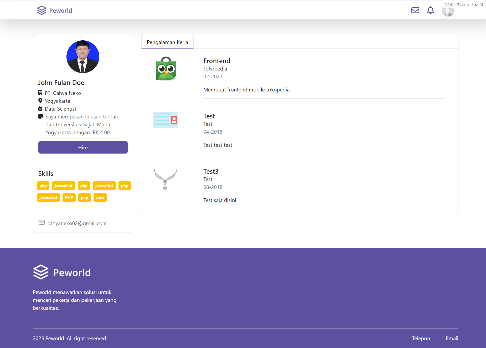
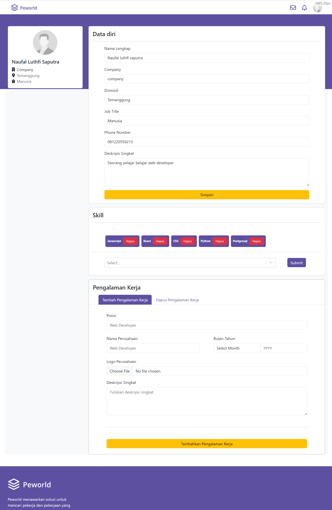
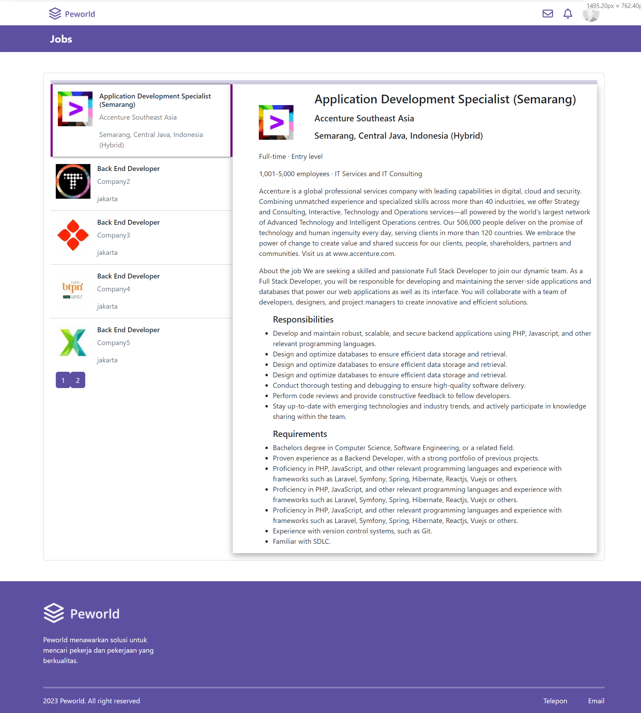

<br />
<p align="center">

  <h3 align="center">HireJob Application</h3>
  <p align="center">
    <a href="/">View Demo</a>
  </p>
</p>

## About The Project

Peworld is a job-search platform based on web application build with next.js, where user can register as job seekers and looking for workers with a specific criteria needed.

## Project Structure

```
|── HIRE-JOB
   |── components      # component items
   |── documentation   # Screenshots of the application
   |── pages           # Pages source code
   |── public          # Public Assets
   |── store           # redux configuration
   |── styles          # Application Styling
   |── .env            # Environment variables
   |── .gitignore      # Files that should be ignored
   |── README.md       # Readme
```

This is a [Next.js](https://nextjs.org/) project bootstrapped with [`create-next-app`](https://github.com/vercel/next.js/tree/canary/packages/create-next-app).

## Features:

- Job listing page
- Job detail page
- User profile page
- Authentication using JWT
- Server side rendering
- Incremental Static Regeneration

## Below are lists of modules used in this application:

- [Next.js](https://nextjs.org/)
- [Redux](https://redux.js.org/)
- [Bootstrap](https://getbootstrap.com/)
- [Axios](https://axios-http.com/)
- [Dotenv](https://www.npmjs.com/package/dotenv)

## Documentation

<table>
<tr>
<td></td>
    <td> </td>
</tr>
<td></td>
    <td> </td>
</tr>
<td></td>
    <td> </td>
</tr>
<td></td>
    <td> </td>
</tr>
</table>

## Getting Started

### Prerequisites

This is an example of things you need to use the application and how to install them.

- [node.js](https://nodejs.org/en/download/)

### Installation

1. Clone the repo

```sh
git clone https://github.com/https://github.com/nluthfis/fe-next-hire-job
```

2. Install NPM packages

```sh
npm install
```

3. Add .env file at your frontend root folder project, and add the following

```sh
REACT_APP_BACKEND_URL = your_api_url

```

- First, run the development server:
- bash
- npm run dev
- Open http://localhost:3000 with your browser to see the result.

You can start editing the page by modifying pages/index.js. The page auto-updates as you edit the file.
Learn More

To learn more about Next.js, take a look at the following resources:
Next.js Documentation - learn

## Deploy on Vercel

Check out https://fe-next-hire-job.vercel.app for more details.

## Related Project

:rocket: [`Backend`](https://github.com/nluthfis/hire_job_be)

:rocket: [`Demo`](fe-next-hire-job.vercel.app)
