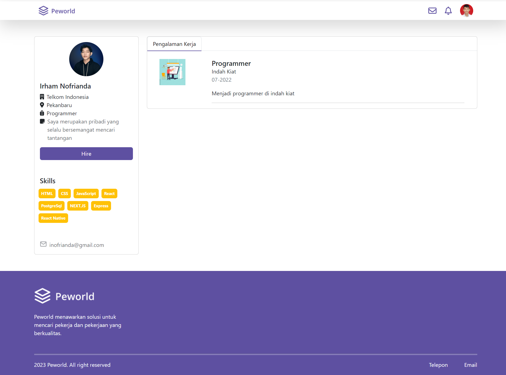

<br />
<p align="center">

  <h3 align="center">HireJob Application</h3>
  <p align="center">
    <a href="https://hire-job-web.vercel.app/">View Demo</a>
  </p>
</p>

## About The Project

Peworld is a job-search platform based on web application build with next.js, where user can register as job seekers and looking for workers with a specific criteria needed.

## Table of Contents

- [Features](#features)
- [Technologies Used](#technologies-used)
- [Getting Started](#getting-started)
  - [Prerequisites](#prerequisites)
  - [Installation](#installation)
- [Documentation](#documentation)
- [Related Projects](#related-projects)
- [Authors](#authors)

This is a [Next.js](https://nextjs.org/) project bootstrapped with [`create-next-app`](https://github.com/vercel/next.js/tree/canary/packages/create-next-app).

## Features:

- Job listing page
- Job detail page
- User profile page
- Authentication using JWT
- Server side rendering
- Incremental Static Regeneration

## Technologies Used:

- [Next.js](https://nextjs.org/)
- [Redux](https://redux.js.org/)
- [Bootstrap](https://getbootstrap.com/)
- [Axios](https://axios-http.com/)
- [Dotenv](https://www.npmjs.com/package/dotenv)

## Documentation

<table>
<tr>
  <td>Login Page</td>
  <td>Register Page</td>
<tr>
<td></td>
    <td> </td>
</tr>
<tr>
  <td>Home Page</td>
  <td>Candidate Page</td>
<tr>
<td></td>
    <td> </td>
</tr>
<tr>
  <td>Profile Page</td>
  <td>Profile Other User Page</td>
<tr>
<td></td>
    <td> </td>
</tr>
<tr>
  <td>Edit Profile Page</td>
  <td>Find Job Page</td>
<tr>
<td></td>
    <td> </td>
</tr>
</table>

## Getting Started:

These instructions will get you a copy of the project up and running on your local machine for development and testing purposes.

### Prerequisites:

This is an example of things you need to use the application and how to install them.

- [node.js](https://nodejs.org/en/download/)

### Installation

1. Clone the repo

```sh
git clone https://github.com/nluthfis/hire-job-web.git
```

2. Install NPM packages

```sh
npm install
```

3. Add .env file at your frontend root folder project, and add the following

```sh
REACT_APP_BACKEND_URL = hire-job.onrender.com
```

- First, run the development server:
- bash
- npm run dev
- Open http://localhost:3000 with your browser to see the result.

You can start editing the page by modifying pages/index.js. The page auto-updates as you edit the file.
Learn More

To learn more about Next.js, take a look at the following resources:
Next.js Documentation - learn

## Related Project

:rocket: [`Backend`](https://github.com/nluthfis/hire_job_be)

:rocket: [`Demo`](https://hire-job-web.vercel.app)

## Authors

Contributors names and contact info:

1. Naufal Luthfi Saputra

- [Linkedin](https://www.linkedin.com/in/naufal-luthfi-saputra/)

Feel free to check out the related projects and the provided Postman documentation for the API endpoints. If you have any questions or feedback, please don't hesitate to reach out to the author. Happy coding!
